# Nexus — Architecture & C4 Model

> **Scope:** Full repo analysis of the Nexus workspace (Rust, ~16 crates + Tauri app).
> **Date generated:** 2026-04-14
> **Status mapped:** v0.1.0 alpha (microkernel, WASM plugins, RAG, MCP server, theming, TUI, CLI, Tauri shell)

This document delivers the **complete C4 Model** (Context → Containers → Components → Code) for Nexus, plus supplementary architecture diagrams (dependency graph, RAG pipeline, plugin lifecycle, event bus flow, security model, theming cascade, deployment topology, forge persistence layout).

All diagrams are authored in [Mermaid](https://mermaid.js.org/) and will render directly on GitHub, VS Code, and most modern Markdown viewers.

---

## Table of Contents

1. [Bird's-Eye Summary](#1-birds-eye-summary)
2. [C4 Level 1 — System Context](#2-c4-level-1--system-context)
3. [C4 Level 2 — Containers](#3-c4-level-2--containers)
4. [C4 Level 3 — Components](#4-c4-level-3--components)
    - 4.1 [Kernel & Plugin Substrate](#41-kernel--plugin-substrate)
    - 4.2 [Storage Subsystem](#42-storage-subsystem)
    - 4.3 [AI & RAG Subsystem](#43-ai--rag-subsystem)
    - 4.4 [MCP Server](#44-mcp-server)
    - 4.5 [CLI Binary](#45-cli-binary)
    - 4.6 [TUI Binary](#46-tui-binary)
    - 4.7 [Tauri Desktop Shell](#47-tauri-desktop-shell)
    - 4.8 [Theming Engine](#48-theming-engine)
    - 4.9 [Security & Capability Enforcement](#49-security--capability-enforcement)
5. [C4 Level 4 — Code (key abstractions)](#5-c4-level-4--code-key-abstractions)
6. [Supplementary Diagrams](#6-supplementary-diagrams)
    - 6.1 [Crate Dependency Graph](#61-crate-dependency-graph)
    - 6.2 [RAG Query Sequence](#62-rag-query-sequence)
    - 6.3 [Plugin Lifecycle State Machine](#63-plugin-lifecycle-state-machine)
    - 6.4 [Event Bus Publish/Subscribe Flow](#64-event-bus-publishsubscribe-flow)
    - 6.5 [Capability Enforcement Flow](#65-capability-enforcement-flow)
    - 6.6 [Theming Cascade](#66-theming-cascade)
    - 6.7 [Forge Persistence Layout](#67-forge-persistence-layout)
    - 6.8 [Deployment Topology](#68-deployment-topology)
    - 6.9 [MCP Tool Dispatch](#69-mcp-tool-dispatch)
7. [Architectural Invariants & Guardrails](#7-architectural-invariants--guardrails)
8. [Legend](#8-legend)

---

## 1. Bird's-Eye Summary

Nexus is an **AI-native, plugin-extensible knowledge environment** built as a Rust workspace. The architecture follows a **microkernel** pattern: a small core (`nexus-kernel`) provides event bus, IPC dispatch, capability enforcement, and plugin lifecycle. All real functionality lives in independent *subsystem crates* that register themselves as **core plugins** at bootstrap, or as **community WASM plugins** at runtime.

Four invariants drive the shape of the system:

1. **File-as-truth** — Markdown files on disk are authoritative; the SQLite index is rebuildable.
2. **Microkernel isolation** — The kernel depends only on `nexus-types`. Subsystems depend on kernel; kernel never depends on subsystems.
3. **IPC over direct calls** — Even the CLI and TUI talk to storage/AI only through `PluginContext::ipc_call`, the same path community plugins use. This makes the boundary uniform.
4. **Capabilities gate everything** — `fs.read`, `kv.write`, `ipc.call`, `events.publish`, etc. Every kernel-mediated operation checks a capability before it runs.

Three **invoker binaries** (CLI, TUI, Tauri desktop) all reach the same runtime via `nexus-bootstrap`. A fourth **MCP server mode** exposes 13 tools to external AI clients (Claude Desktop, Cursor) over stdio.

---

## 2. C4 Level 1 — System Context

Shows Nexus as a single system with its external actors and services.

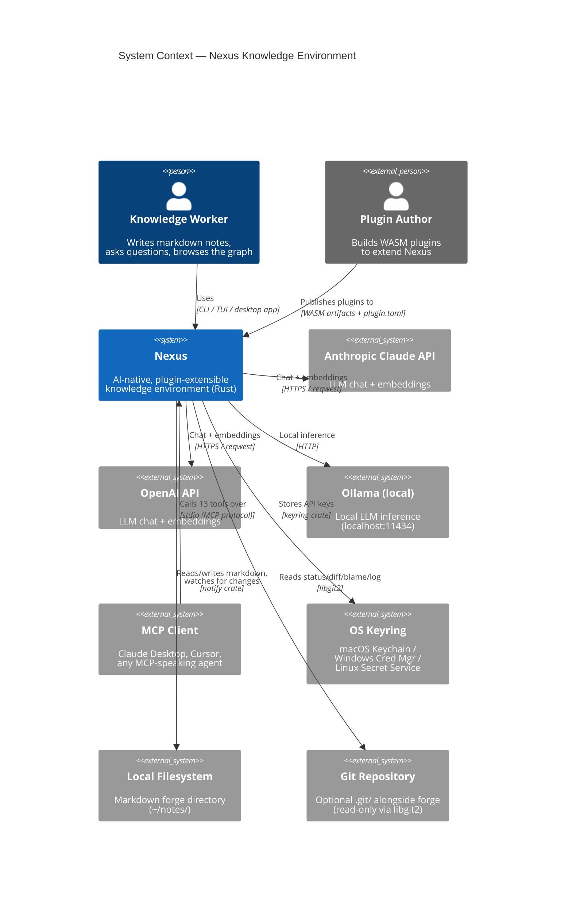
```mermaid
C4Context
    title System Context — Nexus Knowledge Environment

    Person(user, "Knowledge Worker", "Writes markdown notes,<br/>asks questions, browses the graph")
    Person_Ext(author, "Plugin Author", "Builds WASM plugins<br/>to extend Nexus")

    System(nexus, "Nexus", "AI-native, plugin-extensible<br/>knowledge environment (Rust)")

    System_Ext(anthropic, "Anthropic Claude API", "LLM chat + embeddings")
    System_Ext(openai, "OpenAI API", "LLM chat + embeddings")
    System_Ext(ollama, "Ollama (local)", "Local LLM inference<br/>(localhost:11434)")

    System_Ext(mcpclient, "MCP Client", "Claude Desktop, Cursor,<br/>any MCP-speaking agent")

    System_Ext(keyring, "OS Keyring", "macOS Keychain /<br/>Windows Cred Mgr /<br/>Linux Secret Service")
    System_Ext(fs, "Local Filesystem", "Markdown forge directory<br/>(~/notes/)")
    System_Ext(git, "Git Repository", "Optional .git/ alongside forge<br/>(read-only via libgit2)")

    Rel(user, nexus, "Uses", "CLI / TUI / desktop app")
    Rel(author, nexus, "Publishes plugins to", "WASM artifacts + plugin.toml")
    Rel(mcpclient, nexus, "Calls 13 tools over", "stdio (MCP protocol)")

    Rel(nexus, anthropic, "Chat + embeddings", "HTTPS / reqwest")
    Rel(nexus, openai, "Chat + embeddings", "HTTPS / reqwest")
    Rel(nexus, ollama, "Local inference", "HTTP")

    Rel(nexus, keyring, "Stores API keys", "keyring crate")
    Rel(nexus, fs, "Reads/writes markdown,<br/>watches for changes", "notify crate")
    Rel(nexus, git, "Reads status/diff/blame/log", "libgit2")

    UpdateLayoutConfig($c4ShapeInRow="3", $c4BoundaryInRow="1")
```

### Actors & External Systems

| Actor / System | Role | Protocol |
|---|---|---|
| Knowledge Worker | Primary user (notes, search, RAG) | CLI, TUI, Tauri |
| Plugin Author | Extends Nexus with WASM plugins | `plugin.toml` + `.wasm` |
| MCP Client | External AI agent consuming Nexus | stdio / MCP |
| Anthropic Claude API | LLM provider (chat + embeddings) | HTTPS |
| OpenAI API | LLM provider (chat + embeddings) | HTTPS |
| Ollama | Local LLM inference | HTTP localhost |
| OS Keyring | Secure credential vault | Native OS APIs |
| Local Filesystem | Source of truth (markdown) | fs + notify |
| Git Repository | Optional version history | libgit2 (read-only in v0.1) |

---

## 3. C4 Level 2 — Containers

Breaks Nexus into its deployable / runnable units. A "container" here is either a binary, a library, a sandbox, or a data store.

```mermaid
C4Container
    title Containers — Nexus (v0.1.0)

    Person(user, "Knowledge Worker")
    Person(author, "Plugin Author")
    System_Ext(mcpclient, "MCP Client")
    System_Ext(llm, "LLM APIs", "Anthropic / OpenAI / Ollama")
    System_Ext(keyring, "OS Keyring")
    SystemDb_Ext(fs, "Markdown Forge", "~/notes/*.md<br/>.forge/ metadata")

    Container_Boundary(nexus, "Nexus") {
        Container(cli, "nexus (CLI)", "Rust binary / clap", "Headless CLI —<br/>forge/content/graph/ai/plugin/mcp/...")
        Container(tui, "nexus-tui (TUI)", "Rust binary / ratatui", "Interactive terminal UI —<br/>file tree, viewer, backlinks")
        Container(app, "nexus-app (Desktop)", "Tauri 2 + Vite/React", "Desktop shell —<br/>theme picker, workspace layout")

        Container(bootstrap, "nexus-bootstrap", "Rust library", "Assembles runtime:<br/>kernel + core plugins + invoker")
        Container(kernel, "nexus-kernel", "Rust library", "Event bus, IPC dispatch,<br/>capability enforcement,<br/>plugin lifecycle")

        Container(storage, "nexus-storage (core plugin)", "Rust library", "File-as-truth, SQLite index,<br/>Tantivy FTS, graph, watcher")
        Container(ai, "nexus-ai (core plugin)", "Rust library", "AI providers, embeddings,<br/>RAG pipeline")
        Container(database, "nexus-database (core plugin)", "Rust library", "Bases support: property types,<br/>validation, formulas,<br/>CSV import/export (no SQL).<br/>IPC: csv_import, csv_export, formula_eval")
        Container(security, "nexus-security (core plugin)", "Rust library", "Credential vault, audit log,<br/>path validator")
        Container(mcp, "nexus-mcp", "Rust library / rmcp", "13-tool MCP server<br/>over stdio")

        Container(plugins, "nexus-plugins", "Rust library / wasmtime", "WASM sandbox, manifest parser,<br/>hot-reloader, scaffolder")
        Container_Boundary(sandbox, "WASM Sandbox") {
            Container(comm_plugin, "Community Plugin", ".wasm module", "User-authored extension<br/>(capability-gated)")
        }

        Container(theme, "nexus-theme", "Rust library", "CSS variable cascade,<br/>theme manifests, layout tree")
        Container(git, "nexus-git", "Rust library / libgit2", "Read-only git:<br/>status/diff/blame/log")

        ContainerDb(sqlite, "SQLite Index", ".forge/index.db", "Files, blocks, links, tags,<br/>properties, embeddings, tasks,<br/>canvas, bases")
        ContainerDb(tantivy, "Tantivy Index", ".forge/search/", "Full-text search index")
        ContainerDb(kv, "Kernel KV", ".forge/kv.sqlite3", "Plugin settings, cached state")
        ContainerDb(audit, "Audit Log", ".forge/logs/audit.log", "Append-only capability<br/>decisions & IPC calls")
    }

    Rel(user, cli, "Runs commands")
    Rel(user, tui, "Browses interactively")
    Rel(user, app, "Uses GUI")
    Rel(mcpclient, mcp, "stdio (MCP)")
    Rel(author, plugins, "Installs .wasm artifacts")

    Rel(cli, bootstrap, "Builds runtime")
    Rel(tui, bootstrap, "Builds runtime")
    Rel(app, theme, "Theme engine")
    Rel(cli, mcp, "Hosts server")

    Rel(bootstrap, kernel, "Wires")
    Rel(bootstrap, storage, "Registers as core plugin")
    Rel(bootstrap, ai, "Registers as core plugin")
    Rel(bootstrap, security, "Registers as core plugin")
    Rel(bootstrap, plugins, "Loads WASM plugins")
    Rel(storage, database, "Links as library", "types, validation, formulas")

    Rel(kernel, storage, "IPC dispatch", "ipc_call")
    Rel(kernel, ai, "IPC dispatch", "ipc_call")
    Rel(kernel, security, "Capability checks")
    Rel(plugins, kernel, "Host fns → kernel ops")
    Rel(comm_plugin, plugins, "Host fn calls", "nexus_ipc_call,<br/>nexus_fs_*, nexus_kv_*,<br/>nexus_publish, ...")

    Rel(storage, sqlite, "R/W", "rusqlite + r2d2")
    Rel(storage, tantivy, "Index / query")
    Rel(storage, fs, "Read/write .md,<br/>watch for changes", "notify")
    Rel(kernel, kv, "Plugin KV")
    Rel(security, audit, "Append records")
    Rel(security, keyring, "Get/set secrets")

    Rel(ai, llm, "HTTPS", "reqwest")
    Rel(ai, storage, "vectorstore_search, index_file", "ipc_call")
    Rel(mcp, storage, "13 tool bodies<br/>route via IPC", "ipc_call (30s)")
    Rel(mcp, ai, "nexus_ask route", "ipc_call (120s)")

    UpdateLayoutConfig($c4ShapeInRow="4", $c4BoundaryInRow="2")
```

### Container Responsibilities

| Container | Kind | Tech | Role |
|---|---|---|---|
| `nexus` (CLI) | Binary | Rust + clap | Headless CLI; also hosts MCP server |
| `nexus-tui` | Binary | Rust + ratatui + crossterm | Interactive terminal UI |
| `nexus-bootstrap` | Library | Rust | Runtime assembler |
| `nexus-kernel` | Library | Rust + tokio | Event bus, IPC, capabilities, lifecycle |
| `nexus-plugin-api` | Library | Rust | CorePlugin trait, IPC envelope types, capability taxonomy |
| `nexus-storage` | Core plugin | rusqlite, tantivy, comrak, notify | File-as-truth, index, graph, **bases engine** (schema/query/relation) |
| `nexus-ai` | Core plugin | reqwest, async-trait | Providers, embeddings, RAG |
| `nexus-agent` | Core plugin | Rust | Agent mode orchestration + history |
| `nexus-editor` | Core plugin | Rust | Editor session + buffer management |
| `nexus-skills` | Core plugin | Rust | Skill packs / templates |
| `nexus-workflow` | Core plugin | Rust | Workflow automation engine |
| `nexus-terminal` | Core plugin | portable-pty, rusqlite | PTY sessions + saved commands |
| `nexus-linkpreview` | Core plugin | reqwest, scraper | URL metadata fetch for previews |
| `nexus-database` | Core plugin | csv, regex-lite | Bases support: property types, validation, formulas, CSV import/export (no SQL). IPC: `csv_import`, `csv_export`, `formula_eval` |
| `nexus-security` | Core plugin | keyring | Vault, audit, path validation |
| `nexus-plugins` | Library | wasmtime, notify, jsonschema | WASM sandbox + loader + hot-reload |
| `nexus-mcp` | Library | rmcp, schemars | 13-tool MCP server |
| `nexus-theme` | Library | serde, notify, ts-rs | Theme + layout engine |
| `nexus-git` | Library | git2 | Git read ops |
| `nexus-formats` | Library | comrak, serde_yaml | Markdown/YAML/TOML/canvas parsing |
| `nexus-kv` | Library | rusqlite | SQLite KV backend |
| `nexus-panic-log` | Library | Rust (stdlib only + dirs) | Local panic hook → `~/.nexus-shell/logs/panic.log` |
| `nexus-types` | Library | serde | Shared types (leaf) |

The desktop shell (`shell/src-tauri/`, crate name `nexus-shell`) is workspace-excluded — it's the Tauri 2 + Vite + React plugin-first UI. It consumes the above crates through `nexus-bootstrap`.

---

## 4. C4 Level 3 — Components

Each diagram zooms into one container and shows the components (modules / major types) inside.

### 4.1 Kernel & Plugin Substrate

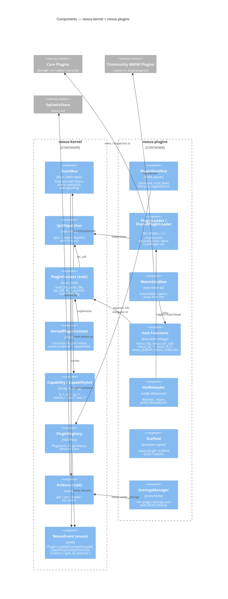
```mermaid
C4Component
    title Components — nexus-kernel + nexus-plugins

    Container_Boundary(kernel, "nexus-kernel") {
        Component(eventbus, "EventBus", "Rust / tokio mpsc", "Pub/sub with filters,<br/>event metadata,<br/>anti-spoofing")
        Component(ipc, "IpcDispatcher", "trait + impl", "Sync + async dispatch<br/>with timeout")
        Component(ctx, "PluginContext (trait)", "async_trait", "read_file, write_file,<br/>ipc_call, kv_*, publish,<br/>subscribe, log")
        Component(ctximpl, "KernelPluginContext", "struct", "Concrete PluginContext<br/>wired to kernel + capabilities")
        Component(caps, "Capability / CapabilitySet", "string hierarchy", "fs.*, kv.*, ipc.*,<br/>events.*, net.*, exec.*")
        Component(reg, "PluginRegistry", "HashMap", "PluginInfo, PluginStatus,<br/>lifecycle state")
        Component(kvtrait, "KvStore (trait)", "async", "get / set / delete /<br/>list_prefix")
        Component(events, "NexusEvent (enum)", "serde", "PluginLoaded/Started/Stopped,<br/>CapabilityGranted/Denied,<br/>Custom { type_id, payload }")
    }

    Container_Boundary(plugins, "nexus-plugins") {
        Component(manifest, "PluginManifest", "TOML parser", "metadata, trust_level,<br/>lifecycle, registrations")
        Component(loader, "PluginLoader /<br/>SharedPluginLoader", "Arc<Mutex<..>>", "Implements<br/>IpcDispatcher; owns<br/>CorePlugin set")
        Component(sandbox, "WasmSandbox", "wasmtime 42", "Instantiates .wasm,<br/>wires host fns")
        Component(hostfns, "Host Functions", "wasmtime linkage", "nexus_log, nexus_ipc_call,<br/>nexus_kv_*, nexus_fs_*,<br/>nexus_publish, nexus_subscribe")
        Component(hot, "HotReloader", "notify-debouncer", "Watches .wasm,<br/>emits ReloadEvent")
        Component(scaffold, "Scaffold", "template engine", "nexus plugin scaffold<br/>(core / wasm)")
        Component(settings, "SettingsManager", "jsonschema", "Per-plugin settings.json<br/>with JSON Schema")
    }

    Container_Ext(core, "Core Plugins", "storage / ai / editor / security")
    Container_Ext(comm, "Community WASM Plugins", ".wasm in .forge/plugins/")
    Container_Ext(kv, "SqliteKvStore", "nexus-kv")

    Rel(ctx, eventbus, "publish/subscribe")
    Rel(ctx, ipc, "ipc_call")
    Rel(ctx, kvtrait, "kv_get/set/delete")
    Rel(ctx, caps, "check before op")
    Rel(ctximpl, ctx, "implements")
    Rel(eventbus, events, "carries")
    Rel(reg, events, "emits lifecycle")

    Rel(loader, ipc, "implements")
    Rel(loader, core, "owns / dispatches to")
    Rel(sandbox, hostfns, "links")
    Rel(sandbox, comm, "instantiates")
    Rel(hostfns, ctx, "delegates to")
    Rel(hot, loader, "triggers stop/reload")
    Rel(manifest, reg, "registers info")
    Rel(settings, kvtrait, "stores under _settings")
    Rel(kvtrait, kv, "backed by")
```

**Key behaviours:**

- `PluginContext` is the **one** surface that plugins (core or WASM) use to talk to the rest of the system. Everything else is implementation detail.
- `SharedPluginLoader` implements `IpcDispatcher` — so the kernel only knows about the *trait*, and any loader (test, production, sandboxed) can be substituted.
- WASM host functions are thin shims that turn guest pointers into safe Rust values and forward to `PluginContext`. Every host fn is capability-gated.
- **Anti-spoofing:** the kernel sets `emitting_plugin` on every published event; plugins cannot set it themselves, and `Custom.type_id` must start with the emitter's ID.

---

### 4.2 Storage Subsystem

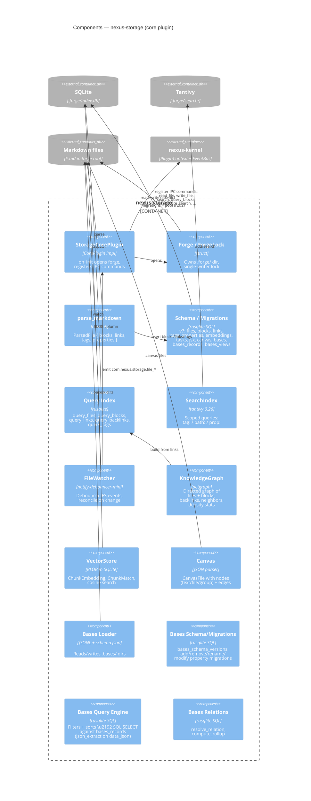
```mermaid
C4Component
    title Components — nexus-storage (core plugin)

    Container_Boundary(storage, "nexus-storage") {
        Component(core, "StorageCorePlugin", "CorePlugin impl", "on_init opens forge,<br/>registers IPC commands")
        Component(forge, "Forge / ForgeLock", "struct", "Owns .forge/ dir,<br/>single-writer lock")
        Component(parser, "parse_markdown", "comrak", "ParsedFile { blocks, links,<br/>tags, properties }")
        Component(schema, "Schema / Migrations", "rusqlite SQL", "v7: files, blocks, links,<br/>tags, properties, embeddings,<br/>tasks, jsx, canvas, bases,<br/>bases_records, bases_views")
        Component(index, "Query Index", "rusqlite", "query_files, query_blocks,<br/>query_links, query_backlinks,<br/>query_tags")
        Component(fts, "SearchIndex", "tantivy 0.26", "Scoped queries:<br/>tag: / path: / prop:")
        Component(watcher, "FileWatcher", "notify-debouncer-mini", "Debounced FS events,<br/>reconcile on change")
        Component(graph, "KnowledgeGraph", "petgraph", "Directed graph of<br/>files + blocks,<br/>backlinks, neighbors,<br/>density stats")
        Component(vector, "VectorStore", "BLOB in SQLite", "ChunkEmbedding, ChunkMatch,<br/>cosine search")
        Component(canvas, "Canvas", "JSON parser", "CanvasFile with nodes<br/>(text/file/group) + edges")
        Component(bases, "Bases Loader", "JSONL + schema.json", "Reads/writes .bases/ dirs")
        Component(bschema, "Bases Schema/Migrations", "rusqlite SQL", "bases_schema_versions:<br/>add/remove/rename/<br/>modify property migrations")
        Component(bquery, "Bases Query Engine", "rusqlite SQL", "Filters + sorts \u2192 SQL SELECT<br/>against bases_records<br/>(json_extract on data_json)")
        Component(brel, "Bases Relations", "rusqlite SQL", "resolve_relation,<br/>compute_rollup")
    }

    ContainerDb_Ext(db, "SQLite", ".forge/index.db")
    ContainerDb_Ext(tv, "Tantivy", ".forge/search/")
    ContainerDb_Ext(files, "Markdown files", "*.md in forge root")
    Container_Ext(kernelx, "nexus-kernel", "PluginContext + EventBus")

    Rel(core, forge, "opens")
    Rel(core, kernelx, "register IPC commands:<br/>read_file, write_file,<br/>search, query_blocks,<br/>vectorstore_search, ...")
    Rel(forge, files, "read/write (atomic)")
    Rel(parser, files, "parse")
    Rel(parser, schema, "insert blocks/links/tags")
    Rel(schema, db, "migrations + pool (r2d2)")
    Rel(index, db, "SELECT")
    Rel(fts, tv, "add/search")
    Rel(watcher, files, "watch")
    Rel(watcher, core, "emit com.nexus.storage.file_*")
    Rel(graph, index, "build from links")
    Rel(vector, db, "BLOB column")
    Rel(canvas, files, ".canvas files")
    Rel(bases, files, ".bases/ dirs")
```

**Guardrails:**

- `nexus-storage` is the **sole owner** of `rusqlite` and the forge's SQLite database (`index.db`). No other plugin or library links `rusqlite` — they reach storage via `ipc_call("com.nexus.storage", ...)`. The guardrail is enforced by `crates/nexus-bootstrap/tests/dep_invariants.rs` (forbidden pairs include `("nexus-ai", "nexus-storage")`, `("nexus-database", "rusqlite")`, `("nexus-kernel", "rusqlite")`, etc.).
- `nexus-database` is a pure-logic library (no rusqlite): property types, validation, Notion-compatible formulas, CSV import/export. The SQL-backed query/schema/relation engine for bases lives here under `nexus_storage::bases::{schema, query, relation}`. The library's pure helpers are also exposed over IPC as the `com.nexus.database` core plugin (`csv_import`, `csv_export`, `formula_eval`) so invokers can use them without a direct `nexus-database` dep.
- File writes go through `atomic_write` (temp + fsync + rename) to prevent corruption.
- Index is rebuildable from disk: `reconcile()` compares filesystem vs index and patches.

---

### 4.3 AI & RAG Subsystem

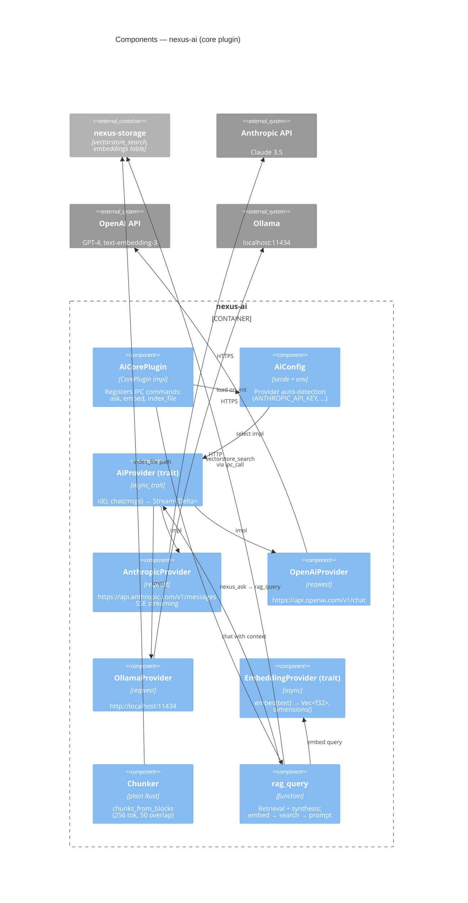
```mermaid
C4Component
    title Components — nexus-ai (core plugin)

    Container_Boundary(ai, "nexus-ai") {
        Component(core, "AiCorePlugin", "CorePlugin impl", "Registers IPC commands:<br/>ask, embed, index_file")
        Component(config, "AiConfig", "serde + env", "Provider auto-detection<br/>(ANTHROPIC_API_KEY, ...)")
        Component(provider, "AiProvider (trait)", "async_trait", "id(), chat(msgs) → Stream<Delta>")
        Component(anthropic, "AnthropicProvider", "reqwest", "https://api.anthropic.com/v1/messages<br/>SSE streaming")
        Component(openai, "OpenAiProvider", "reqwest", "https://api.openai.com/v1/chat")
        Component(ollama, "OllamaProvider", "reqwest", "http://localhost:11434")
        Component(embed, "EmbeddingProvider (trait)", "async", "embed(text) → Vec<f32>,<br/>dimensions()")
        Component(chunker, "Chunker", "plain Rust", "chunks_from_blocks<br/>(256 tok, 50 overlap)")
        Component(rag, "rag_query", "function", "Retrieval + synthesis:<br/>embed → search → prompt")
    }

    Container_Ext(storagex, "nexus-storage", "vectorstore_search,<br/>embeddings table")
    System_Ext(anthropicapi, "Anthropic API", "Claude 3.5")
    System_Ext(openaiapi, "OpenAI API", "GPT-4, text-embedding-3")
    System_Ext(ollamahost, "Ollama", "localhost:11434")

    Rel(core, config, "load on_init")
    Rel(config, provider, "select impl")
    Rel(provider, anthropic, "impl")
    Rel(provider, openai, "impl")
    Rel(provider, ollama, "impl")
    Rel(anthropic, anthropicapi, "HTTPS")
    Rel(openai, openaiapi, "HTTPS")
    Rel(ollama, ollamahost, "HTTP")
    Rel(rag, embed, "embed query")
    Rel(rag, storagex, "vectorstore_search<br/>via ipc_call")
    Rel(rag, provider, "chat with context")
    Rel(chunker, storagex, "index_file path")
    Rel(core, rag, "nexus_ask → rag_query")
```

---

### 4.4 MCP Server

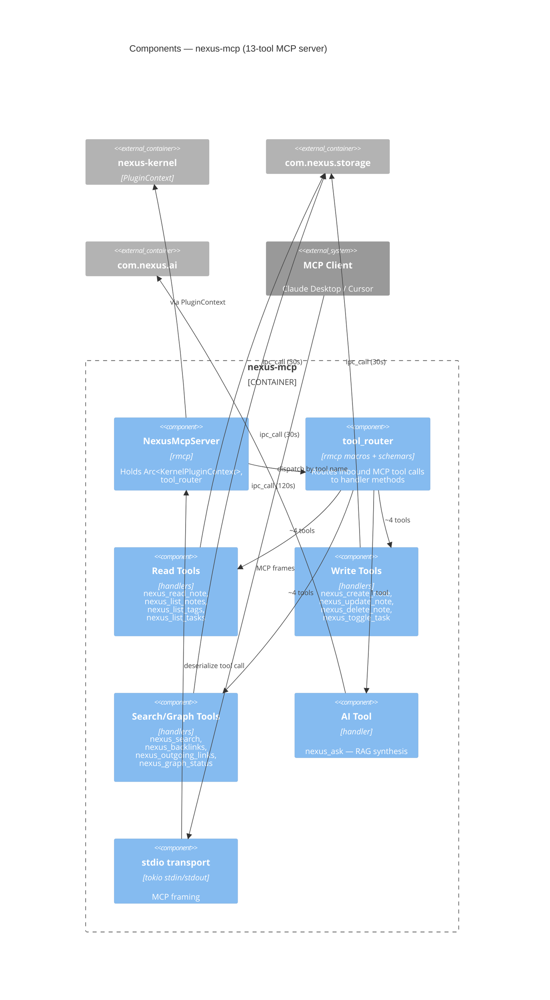
```mermaid
C4Component
    title Components — nexus-mcp (13-tool MCP server)

    Container_Boundary(mcp, "nexus-mcp") {
        Component(server, "NexusMcpServer", "rmcp", "Holds Arc<KernelPluginContext>,<br/>tool_router")
        Component(router, "tool_router", "rmcp macros + schemars", "Routes inbound MCP tool calls<br/>to handler methods")
        Component(readt, "Read Tools", "handlers", "nexus_read_note,<br/>nexus_list_notes,<br/>nexus_list_tags,<br/>nexus_list_tasks")
        Component(writet, "Write Tools", "handlers", "nexus_create_note,<br/>nexus_update_note,<br/>nexus_delete_note,<br/>nexus_toggle_task")
        Component(searcht, "Search/Graph Tools", "handlers", "nexus_search,<br/>nexus_backlinks,<br/>nexus_outgoing_links,<br/>nexus_graph_status")
        Component(askt, "AI Tool", "handler", "nexus_ask — RAG synthesis")
        Component(stdio, "stdio transport", "tokio stdin/stdout", "MCP framing")
    }

    Container_Ext(kernelx, "nexus-kernel", "PluginContext")
    Container_Ext(storagex, "com.nexus.storage")
    Container_Ext(aix, "com.nexus.ai")
    System_Ext(client, "MCP Client", "Claude Desktop / Cursor")

    Rel(client, stdio, "MCP frames")
    Rel(stdio, server, "deserialize tool call")
    Rel(server, router, "dispatch by tool name")
    Rel(router, readt, "~4 tools")
    Rel(router, writet, "~4 tools")
    Rel(router, searcht, "~4 tools")
    Rel(router, askt, "1 tool")
    Rel(readt, storagex, "ipc_call (30s)")
    Rel(writet, storagex, "ipc_call (30s)")
    Rel(searcht, storagex, "ipc_call (30s)")
    Rel(askt, aix, "ipc_call (120s)")
    Rel(server, kernelx, "via PluginContext")
```

**The 13 MCP tools** (listed by category):

- **Read** — `nexus_read_note`, `nexus_list_notes`, `nexus_list_tags`, `nexus_list_tasks`
- **Write** — `nexus_create_note`, `nexus_update_note`, `nexus_delete_note`, `nexus_toggle_task`
- **Graph/Search** — `nexus_search`, `nexus_backlinks`, `nexus_outgoing_links`, `nexus_graph_status`
- **AI** — `nexus_ask`

---

### 4.5 CLI Binary

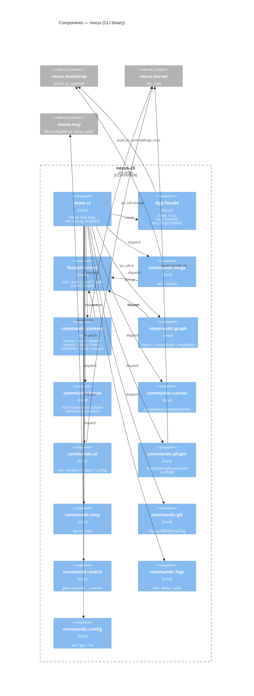
```mermaid
C4Component
    title Components — nexus (CLI binary)

    Container_Boundary(cli, "nexus-cli") {
        Component(main, "main.rs", "entry", "Parse clap args,<br/>init tracing, dispatch")
        Component(app, "App facade", "struct", "forge_root,<br/>lazy runtime,<br/>lazy plugin loader")
        Component(output, "OutputFormat", "enum", "text / json / jsonl / table<br/>(comfy-table)")
        Component(cmd_forge, "commands::forge", "mod", "init / status")
        Component(cmd_content, "commands::content", "mod", "create / read / delete /<br/>search / tasks / links /<br/>backlinks / daily / export")
        Component(cmd_graph, "commands::graph", "mod", "status / unresolved / neighbors")
        Component(cmd_bases, "commands::bases", "mod", "list/create/read/update/<br/>delete/query/export")
        Component(cmd_canvas, "commands::canvas", "mod", "create/read/update/delete")
        Component(cmd_ai, "commands::ai", "mod", "ask / embed / status / config")
        Component(cmd_plugin, "commands::plugin", "mod", "install/list/call/uninstall/<br/>scaffold")
        Component(cmd_mcp, "commands::mcp", "mod", "serve stdio")
        Component(cmd_git, "commands::git", "mod", "status/diff/blame/log")
        Component(cmd_watch, "commands::watch", "mod", "glob watcher → events")
        Component(cmd_logs, "commands::logs", "mod", "tail / show / path")
        Component(cmd_config, "commands::config", "mod", "set / get / list")
    }

    Container_Ext(bootstrap, "nexus-bootstrap", "build_cli_runtime")
    Container_Ext(kernelx, "nexus-kernel", "ipc_call")
    Container_Ext(mcpx, "nexus-mcp", "NexusMcpServer::serve_stdio")

    Rel(main, app, "create")
    Rel(app, bootstrap, "build_cli_runtime(forge_root)")
    Rel(main, cmd_forge, "dispatch")
    Rel(main, cmd_content, "dispatch")
    Rel(main, cmd_graph, "dispatch")
    Rel(main, cmd_bases, "dispatch")
    Rel(main, cmd_canvas, "dispatch")
    Rel(main, cmd_ai, "dispatch")
    Rel(main, cmd_plugin, "dispatch")
    Rel(main, cmd_mcp, "dispatch")
    Rel(main, cmd_git, "dispatch")
    Rel(main, cmd_watch, "dispatch")
    Rel(main, cmd_logs, "dispatch")
    Rel(main, cmd_config, "dispatch")
    Rel(cmd_content, kernelx, "ipc_call storage")
    Rel(cmd_ai, kernelx, "ipc_call ai")
    Rel(cmd_mcp, mcpx, "serve_stdio")
    Rel(cmd_plugin, kernelx, "loader.install/call")
    Rel(cmd_forge, bootstrap, "init_forge")
    Rel(cmd_forge, output, "format")
    Rel(cmd_content, output, "format")
    Rel(cmd_graph, output, "format")
```

---

### 4.6 TUI Binary

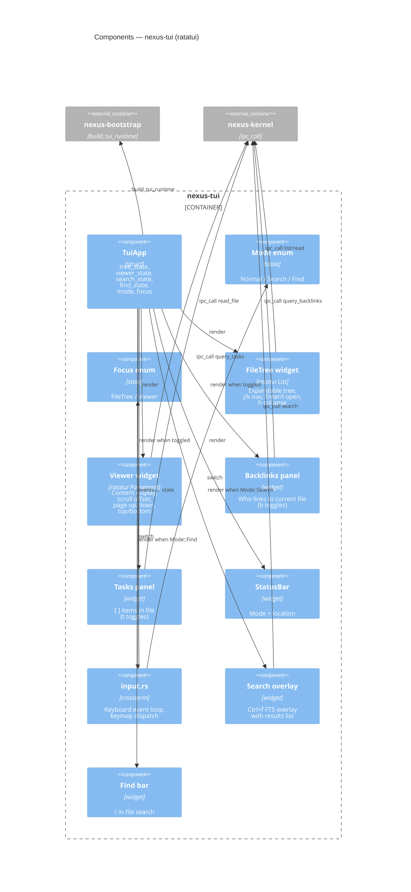
```mermaid
C4Component
    title Components — nexus-tui (ratatui)

    Container_Boundary(tui, "nexus-tui") {
        Component(app, "TuiApp", "struct", "tree_state,<br/>viewer_state,<br/>search_state,<br/>find_state,<br/>mode, focus")
        Component(mode, "Mode enum", "state", "Normal / Search / Find")
        Component(focus, "Focus enum", "state", "FileTree / Viewer")
        Component(tree, "FileTree widget", "ratatui List", "Expandable tree,<br/>j/k nav, Enter/l open,<br/>h collapse")
        Component(viewer, "Viewer widget", "ratatui Paragraph", "Content display,<br/>scroll offset,<br/>page up/down,<br/>top/bottom")
        Component(backlinks, "Backlinks panel", "widget", "Who links to current file<br/>(b toggles)")
        Component(tasks, "Tasks panel", "widget", "[ ] items in file<br/>(t toggles)")
        Component(status, "StatusBar", "widget", "Mode + location")
        Component(input, "input.rs", "crossterm", "Keyboard event loop,<br/>keymap dispatch")
        Component(searcho, "Search overlay", "widget", "Ctrl+f FTS overlay<br/>with results list")
        Component(find, "Find bar", "widget", "/ in-file search")
    }

    Container_Ext(bootstrap, "nexus-bootstrap", "build_tui_runtime")
    Container_Ext(kernelx, "nexus-kernel", "ipc_call")

    Rel(app, input, "events → state")
    Rel(input, mode, "switch")
    Rel(input, focus, "switch")
    Rel(app, tree, "render")
    Rel(app, viewer, "render")
    Rel(app, backlinks, "render when toggled")
    Rel(app, tasks, "render when toggled")
    Rel(app, status, "render")
    Rel(app, searcho, "render when Mode::Search")
    Rel(app, find, "render when Mode::Find")
    Rel(app, bootstrap, "build_tui_runtime")
    Rel(tree, kernelx, "ipc_call list/read")
    Rel(viewer, kernelx, "ipc_call read_file")
    Rel(backlinks, kernelx, "ipc_call query_backlinks")
    Rel(tasks, kernelx, "ipc_call query_tasks")
    Rel(searcho, kernelx, "ipc_call search")
```

---

### 4.7 Tauri Desktop Shell

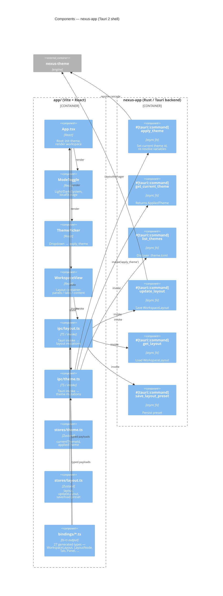
```mermaid
C4Component
    title Components — nexus-app (Tauri 2 shell)

    Container_Boundary(app, "app/ (Vite + React)") {
        Component(appTsx, "App.tsx", "React", "Root; init theme,<br/>render workspace")
        Component(mode, "ModeToggle", "React", "Light/Dark/System,<br/>localStorage")
        Component(picker, "ThemePicker", "React", "Dropdown → apply_theme")
        Component(workspace, "WorkspaceView", "React", "Layout container:<br/>panels / tabs / content")
        Component(ipcLayout, "ipc/layout.ts", "TS / invoke", "Tauri invoke →<br/>layout mutations")
        Component(ipcTheme, "ipc/theme.ts", "TS / invoke", "Tauri invoke →<br/>theme mutations")
        Component(storeTheme, "stores/theme.ts", "Zustand", "currentThemeId,<br/>appliedTheme")
        Component(storeLayout, "stores/layout.ts", "Zustand", "layout,<br/>updateLayout,<br/>save/load preset")
        Component(bindings, "bindings/*.ts", "ts-rs output", "27 generated types —<br/>WorkspaceLayout, LayoutNode,<br/>Tab, Panel, ...")
    }

    Container_Boundary(rs, "nexus-app (Rust / Tauri backend)") {
        Component(cmdApplyTheme, "#[tauri::command]<br/>apply_theme", "async fn", "Set current theme id,<br/>re-resolve variables")
        Component(cmdGetTheme, "#[tauri::command]<br/>get_current_theme", "async fn", "Returns AppliedTheme")
        Component(cmdListThemes, "#[tauri::command]<br/>list_themes", "async fn", "Discover .theme.toml")
        Component(cmdUpdateLayout, "#[tauri::command]<br/>update_layout", "async fn", "Save WorkspaceLayout")
        Component(cmdGetLayout, "#[tauri::command]<br/>get_layout", "async fn", "Load WorkspaceLayout")
        Component(cmdSavePreset, "#[tauri::command]<br/>save_layout_preset", "async fn", "Persist preset")
    }

    Container_Ext(themex, "nexus-theme", "engine")

    Rel(appTsx, mode, "render")
    Rel(appTsx, picker, "render")
    Rel(appTsx, workspace, "render")
    Rel(picker, ipcTheme, "invoke")
    Rel(workspace, ipcLayout, "invoke")
    Rel(ipcTheme, cmdApplyTheme, "invoke('apply_theme')")
    Rel(ipcTheme, cmdGetTheme, "invoke")
    Rel(ipcTheme, cmdListThemes, "invoke")
    Rel(ipcLayout, cmdUpdateLayout, "invoke")
    Rel(ipcLayout, cmdGetLayout, "invoke")
    Rel(ipcLayout, cmdSavePreset, "invoke")
    Rel(cmdApplyTheme, themex, "resolve cascade")
    Rel(cmdUpdateLayout, themex, "LayoutManager")
    Rel(bindings, ipcLayout, "typed payloads")
    Rel(bindings, ipcTheme, "typed payloads")
    Rel(storeTheme, appTsx, "state")
    Rel(storeLayout, appTsx, "state")
```

---

### 4.8 Theming Engine

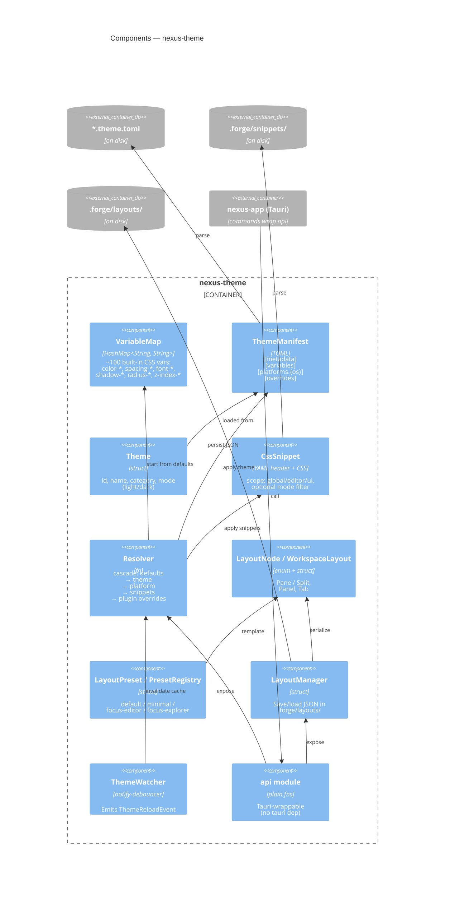
```mermaid
C4Component
    title Components — nexus-theme

    Container_Boundary(theme, "nexus-theme") {
        Component(vars, "VariableMap", "HashMap<String, String>", "~100 built-in CSS vars:<br/>color-*, spacing-*, font-*,<br/>shadow-*, radius-*, z-index-*")
        Component(manifest, "ThemeManifest", "TOML", "[metadata]<br/>[variables]<br/>[platforms.{os}]<br/>[overrides]")
        Component(themeT, "Theme", "struct", "id, name, category, mode<br/>(light/dark)")
        Component(snippet, "CssSnippet", "YAML header + CSS", "scope: global/editor/ui,<br/>optional mode filter")
        Component(resolver, "Resolver", "fn", "cascade: defaults<br/>→ theme<br/>→ platform<br/>→ snippets<br/>→ plugin overrides")
        Component(layout, "LayoutNode / WorkspaceLayout", "enum + struct", "Pane / Split,<br/>Panel, Tab")
        Component(preset, "LayoutPreset / PresetRegistry", "struct", "default / minimal /<br/>focus-editor / focus-explorer")
        Component(mgr, "LayoutManager", "struct", "Save/load JSON in<br/>.forge/layouts/")
        Component(watcher, "ThemeWatcher", "notify-debouncer", "Emits ThemeReloadEvent")
        Component(api, "api module", "plain fns", "Tauri-wrappable<br/>(no tauri dep)")
    }

    ContainerDb_Ext(themes, "*.theme.toml", "on disk")
    ContainerDb_Ext(snips, ".forge/snippets/", "on disk")
    ContainerDb_Ext(layouts, ".forge/layouts/", "on disk")
    Container_Ext(appx, "nexus-app (Tauri)", "commands wrap api")

    Rel(manifest, themes, "parse")
    Rel(snippet, snips, "parse")
    Rel(mgr, layouts, "persist JSON")
    Rel(resolver, vars, "start from defaults")
    Rel(resolver, manifest, "apply theme")
    Rel(resolver, snippet, "apply snippets")
    Rel(watcher, resolver, "invalidate cache")
    Rel(api, resolver, "expose")
    Rel(api, mgr, "expose")
    Rel(appx, api, "call")
    Rel(themeT, manifest, "loaded from")
    Rel(preset, layout, "template")
    Rel(mgr, layout, "serialize")
```

---

### 4.9 Security & Capability Enforcement

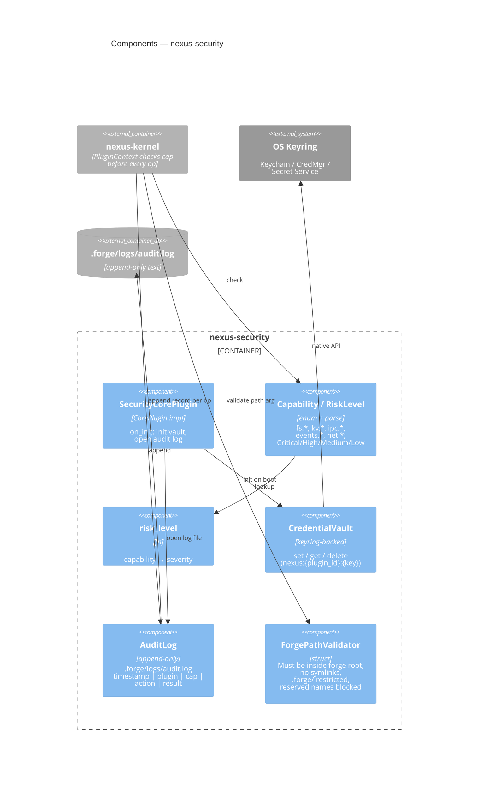
```mermaid
C4Component
    title Components — nexus-security

    Container_Boundary(sec, "nexus-security") {
        Component(core, "SecurityCorePlugin", "CorePlugin impl", "on_init: init vault,<br/>open audit log")
        Component(cap, "Capability / RiskLevel", "enum + parse", "fs.*, kv.*, ipc.*,<br/>events.*, net.*;<br/>Critical/High/Medium/Low")
        Component(risk, "risk_level", "fn", "capability → severity")
        Component(vault, "CredentialVault", "keyring-backed", "set / get / delete<br/>(nexus:{plugin_id}:{key})")
        Component(audit, "AuditLog", "append-only", ".forge/logs/audit.log<br/>timestamp | plugin | cap |<br/>action | result")
        Component(pathv, "ForgePathValidator", "struct", "Must be inside forge root,<br/>no symlinks,<br/>.forge/ restricted,<br/>reserved names blocked")
    }

    Container_Ext(kernelx, "nexus-kernel", "PluginContext checks cap<br/>before every op")
    System_Ext(keyringx, "OS Keyring", "Keychain / CredMgr /<br/>Secret Service")
    ContainerDb_Ext(log, ".forge/logs/audit.log", "append-only text")

    Rel(core, vault, "init on boot")
    Rel(core, audit, "open log file")
    Rel(kernelx, cap, "check")
    Rel(kernelx, pathv, "validate path arg")
    Rel(kernelx, audit, "append record per op")
    Rel(vault, keyringx, "native API")
    Rel(audit, log, "append")
    Rel(cap, risk, "lookup")
```

---

## 5. C4 Level 4 — Code (key abstractions)

The C4 Code level is usually UML class diagrams. Here are the three most architecturally load-bearing types in Nexus, at code granularity.

### 5.1 `PluginContext` trait — the universal surface

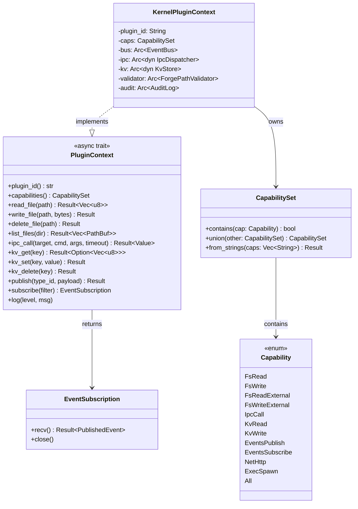
```mermaid
classDiagram
    class PluginContext {
        <<async trait>>
        +plugin_id() str
        +capabilities() CapabilitySet
        +read_file(path) Result~Vec~u8~~
        +write_file(path, bytes) Result
        +delete_file(path) Result
        +list_files(dir) Result~Vec~PathBuf~~
        +ipc_call(target, cmd, args, timeout) Result~Value~
        +kv_get(key) Result~Option~Vec~u8~~~
        +kv_set(key, value) Result
        +kv_delete(key) Result
        +publish(type_id, payload) Result
        +subscribe(filter) EventSubscription
        +log(level, msg)
    }

    class KernelPluginContext {
        -plugin_id: String
        -caps: CapabilitySet
        -bus: Arc~EventBus~
        -ipc: Arc~dyn IpcDispatcher~
        -kv: Arc~dyn KvStore~
        -validator: Arc~ForgePathValidator~
        -audit: Arc~AuditLog~
    }

    class CapabilitySet {
        +contains(cap: Capability) bool
        +union(other: CapabilitySet) CapabilitySet
        +from_strings(caps: Vec~String~) Result
    }

    class Capability {
        <<enum>>
        FsRead
        FsWrite
        FsReadExternal
        FsWriteExternal
        IpcCall
        KvRead
        KvWrite
        EventsPublish
        EventsSubscribe
        NetHttp
        ExecSpawn
        All
    }

    class EventSubscription {
        +recv() Result~PublishedEvent~
        +close()
    }

    KernelPluginContext ..|> PluginContext : implements
    KernelPluginContext --> CapabilitySet : owns
    CapabilitySet --> Capability : contains
    PluginContext --> EventSubscription : returns
```

### 5.2 Event bus message types

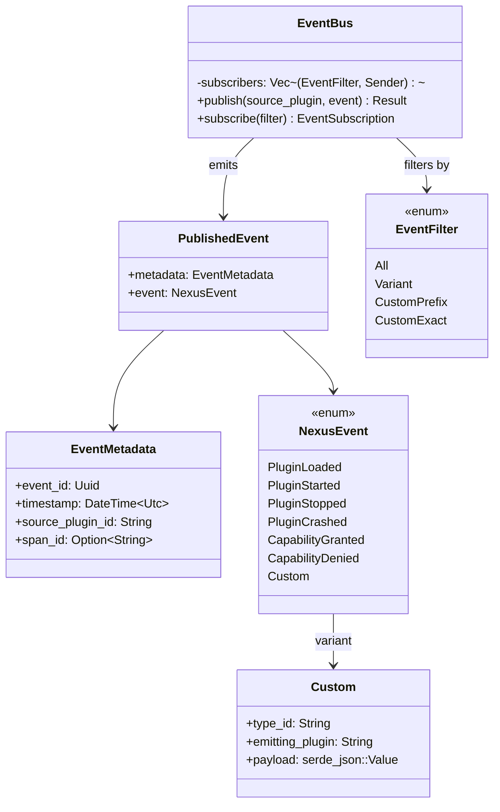
```mermaid
classDiagram
    class PublishedEvent {
        +metadata: EventMetadata
        +event: NexusEvent
    }
    class EventMetadata {
        +event_id: Uuid
        +timestamp: DateTime~Utc~
        +source_plugin_id: String
        +span_id: Option~String~
    }
    class NexusEvent {
        <<enum>>
        PluginLoaded
        PluginStarted
        PluginStopped
        PluginCrashed
        CapabilityGranted
        CapabilityDenied
        Custom
    }
    class Custom {
        +type_id: String
        +emitting_plugin: String
        +payload: serde_json::Value
    }
    class EventFilter {
        <<enum>>
        All
        Variant
        CustomPrefix
        CustomExact
    }
    class EventBus {
        -subscribers: Vec~(EventFilter, Sender)~
        +publish(source_plugin, event) Result
        +subscribe(filter) EventSubscription
    }

    PublishedEvent --> EventMetadata
    PublishedEvent --> NexusEvent
    NexusEvent --> Custom : variant
    EventBus --> EventFilter : filters by
    EventBus --> PublishedEvent : emits
```

### 5.3 AI provider abstraction

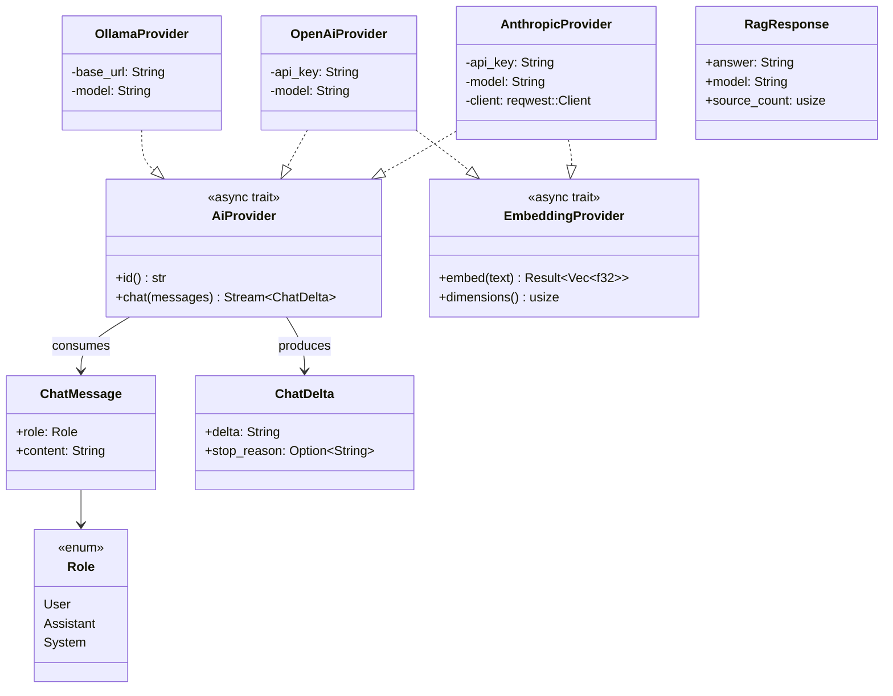
```mermaid
classDiagram
    class AiProvider {
        <<async trait>>
        +id() str
        +chat(messages) Stream~ChatDelta~
    }
    class EmbeddingProvider {
        <<async trait>>
        +embed(text) Result~Vec~f32~~
        +dimensions() usize
    }
    class ChatMessage {
        +role: Role
        +content: String
    }
    class Role {
        <<enum>>
        User
        Assistant
        System
    }
    class ChatDelta {
        +delta: String
        +stop_reason: Option~String~
    }
    class AnthropicProvider {
        -api_key: String
        -model: String
        -client: reqwest::Client
    }
    class OpenAiProvider {
        -api_key: String
        -model: String
    }
    class OllamaProvider {
        -base_url: String
        -model: String
    }
    class RagResponse {
        +answer: String
        +model: String
        +source_count: usize
    }

    AnthropicProvider ..|> AiProvider
    OpenAiProvider ..|> AiProvider
    OllamaProvider ..|> AiProvider
    AnthropicProvider ..|> EmbeddingProvider
    OpenAiProvider ..|> EmbeddingProvider
    ChatMessage --> Role
    AiProvider --> ChatMessage : consumes
    AiProvider --> ChatDelta : produces
```

---

## 6. Supplementary Diagrams

### 6.1 Crate Dependency Graph

Resolved from each crate's `Cargo.toml`. Edges point **from** dependent **to** dependency.

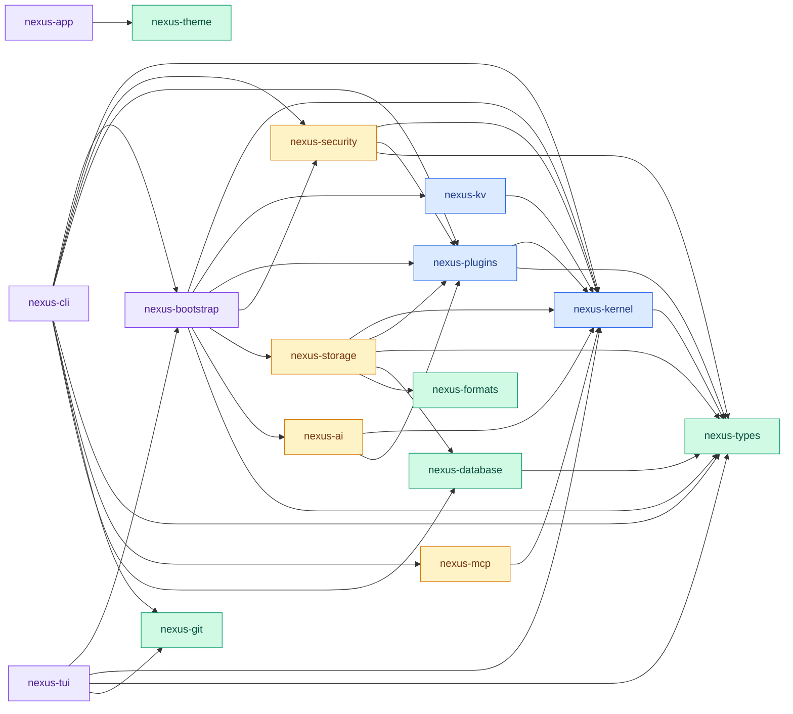
```mermaid
flowchart LR
    types[nexus-types]
    kernel[nexus-kernel]
    kv[nexus-kv]
    plugins[nexus-plugins]
    security[nexus-security]
    formats[nexus-formats]
    database[nexus-database]
    storage[nexus-storage]
    ai[nexus-ai]
    mcp[nexus-mcp]
    theme[nexus-theme]
    git[nexus-git]
    bootstrap[nexus-bootstrap]
    cli[nexus-cli]
    tui[nexus-tui]
    app[nexus-app]

    kernel --> types
    kv --> kernel
    plugins --> kernel
    plugins --> types
    security --> kernel
    security --> plugins
    security --> types
    database --> types
    storage --> kernel
    storage --> plugins
    storage --> types
    storage --> database
    storage --> formats
    ai --> kernel
    ai --> plugins
    mcp --> kernel

    bootstrap --> kernel
    bootstrap --> kv
    bootstrap --> plugins
    bootstrap --> security
    bootstrap --> storage
    bootstrap --> ai
    bootstrap --> types

    cli --> bootstrap
    cli --> kernel
    cli --> security
    cli --> plugins
    cli --> types
    cli --> mcp
    cli --> git
    cli --> database

    tui --> bootstrap
    tui --> kernel
    tui --> types
    tui --> git

    app --> theme

    classDef leaf fill:#d1fae5,stroke:#059669,color:#064e3b;
    classDef core fill:#dbeafe,stroke:#2563eb,color:#1e3a8a;
    classDef plugin fill:#fef3c7,stroke:#d97706,color:#78350f;
    classDef binary fill:#ede9fe,stroke:#7c3aed,color:#4c1d95;

    class types,formats,git,theme,database leaf
    class kernel,kv,plugins core
    class storage,ai,security,mcp plugin
    class bootstrap,cli,tui,app binary
```

**Architectural guardrail (enforced by `crates/nexus-bootstrap/tests/dep_invariants.rs`):**

- **Only `nexus-storage` imports `rusqlite`.** Plugins (`nexus-ai`, community WASM), support libraries (`nexus-database`), and the kernel itself are all forbidden from direct `rusqlite` deps — they go through storage IPC.
- `nexus-cli`, `nexus-tui`, `nexus-mcp`, `nexus-ai`, and `nexus-database` never directly import `nexus-storage`; they route through the kernel.
- `nexus-cli` and `nexus-tui` never directly import `nexus-database` either; CSV import/export and formula evaluation go through `ipc_call("com.nexus.database", …)`.
- `nexus-mcp` never directly imports `nexus-ai`; it dispatches `nexus_ask` via `ipc_call(AI_PLUGIN, "ask", ...)`.
- `nexus-kernel` depends only on `nexus-types`; the SQLite KV impl in `nexus-kv` is injected via `Kernel::new`.

---

### 6.2 RAG Query Sequence

End-to-end flow when a user or MCP client asks a question via `nexus_ask`.

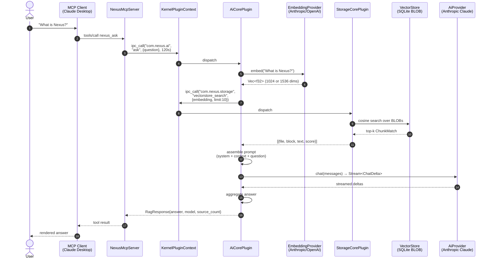
```mermaid
sequenceDiagram
    autonumber
    actor User
    participant MCP as MCP Client<br/>(Claude Desktop)
    participant Server as NexusMcpServer
    participant Ctx as KernelPluginContext
    participant AI as AiCorePlugin
    participant Emb as EmbeddingProvider<br/>(Anthropic/OpenAI)
    participant Storage as StorageCorePlugin
    participant Vec as VectorStore<br/>(SQLite BLOB)
    participant Prov as AiProvider<br/>(Anthropic Claude)

    User->>MCP: "What is Nexus?"
    MCP->>Server: tools/call nexus_ask
    Server->>Ctx: ipc_call("com.nexus.ai",<br/>"ask", {question}, 120s)
    Ctx->>AI: dispatch
    AI->>Emb: embed("What is Nexus?")
    Emb-->>AI: Vec<f32> (1024 or 1536 dims)
    AI->>Ctx: ipc_call("com.nexus.storage",<br/>"vectorstore_search",<br/>{embedding, limit:10})
    Ctx->>Storage: dispatch
    Storage->>Vec: cosine search over BLOBs
    Vec-->>Storage: top-k ChunkMatch
    Storage-->>AI: [{file, block, text, score}]
    AI->>AI: assemble prompt<br/>(system + context + question)
    AI->>Prov: chat(messages) → Stream<ChatDelta>
    Prov-->>AI: streamed deltas
    AI->>AI: aggregate answer
    AI-->>Server: RagResponse{answer, model, source_count}
    Server-->>MCP: tool result
    MCP-->>User: rendered answer
```

---

### 6.3 Plugin Lifecycle State Machine

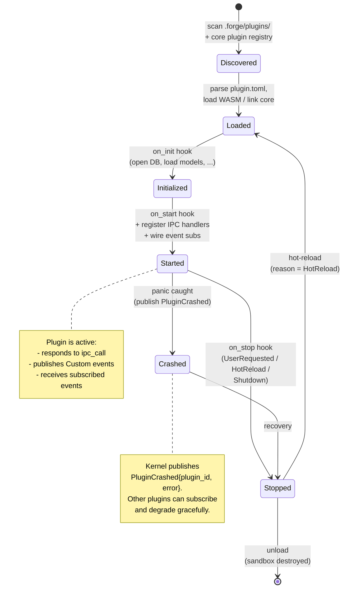
```mermaid
stateDiagram-v2
    [*] --> Discovered: scan .forge/plugins/<br/>+ core plugin registry
    Discovered --> Loaded: parse plugin.toml,<br/>load WASM / link core
    Loaded --> Initialized: on_init hook<br/>(open DB, load models, ...)
    Initialized --> Started: on_start hook<br/>+ register IPC handlers<br/>+ wire event subs
    Started --> Stopped: on_stop hook<br/>(UserRequested / HotReload /<br/>Shutdown)
    Started --> Crashed: panic caught<br/>(publish PluginCrashed)
    Crashed --> Stopped: recovery
    Stopped --> Loaded: hot-reload<br/>(reason = HotReload)
    Stopped --> [*]: unload<br/>(sandbox destroyed)

    note right of Started
        Plugin is active:
         - responds to ipc_call
         - publishes Custom events
         - receives subscribed events
    end note
    note right of Crashed
        Kernel publishes
        PluginCrashed{plugin_id, error}.
        Other plugins can subscribe
        and degrade gracefully.
    end note
```

---

### 6.4 Event Bus Publish/Subscribe Flow

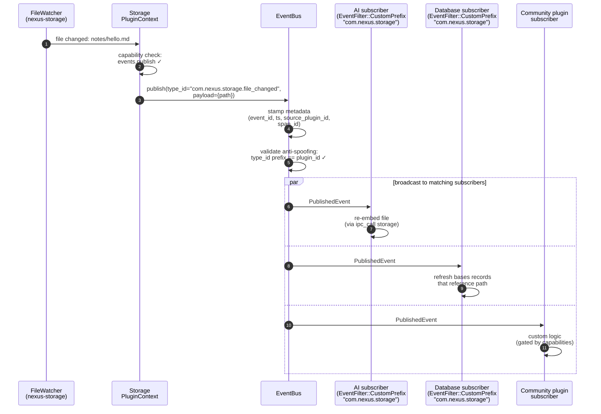
```mermaid
sequenceDiagram
    autonumber
    participant Watcher as FileWatcher<br/>(nexus-storage)
    participant SCtx as Storage<br/>PluginContext
    participant Bus as EventBus
    participant AiSub as AI subscriber<br/>(EventFilter::CustomPrefix<br/>"com.nexus.storage")
    participant DbSub as Database subscriber<br/>(EventFilter::CustomPrefix<br/>"com.nexus.storage")
    participant Commsub as Community plugin<br/>subscriber

    Watcher->>SCtx: file changed: notes/hello.md
    SCtx->>SCtx: capability check:<br/>events.publish ✓
    SCtx->>Bus: publish(type_id="com.nexus.storage.file_changed",<br/>payload={path})
    Bus->>Bus: stamp metadata<br/>(event_id, ts, source_plugin_id,<br/>span_id)
    Bus->>Bus: validate anti-spoofing:<br/>type_id prefix == plugin_id ✓
    par broadcast to matching subscribers
        Bus->>AiSub: PublishedEvent
        AiSub->>AiSub: re-embed file<br/>(via ipc_call storage)
    and
        Bus->>DbSub: PublishedEvent
        DbSub->>DbSub: refresh bases records<br/>that reference path
    and
        Bus->>Commsub: PublishedEvent
        Commsub->>Commsub: custom logic<br/>(gated by capabilities)
    end
```

---

### 6.5 Capability Enforcement Flow

Every kernel-mediated op passes through this gauntlet.

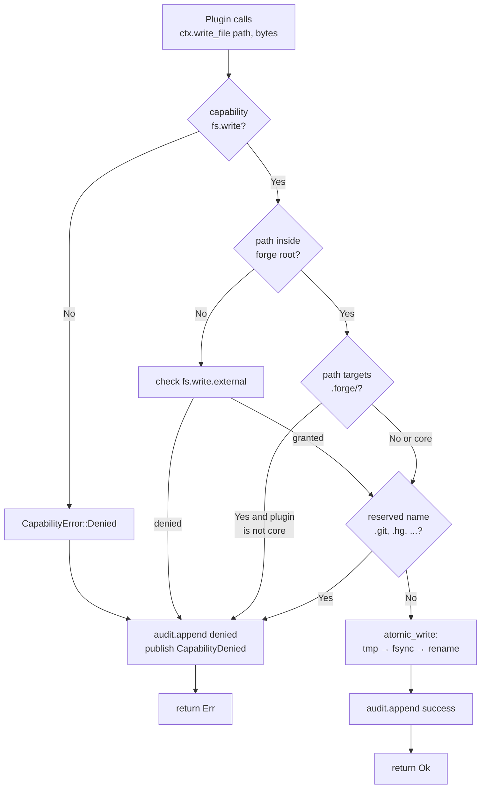
```mermaid
flowchart TD
    A[Plugin calls<br/>ctx.write_file path, bytes] --> B{capability<br/>fs.write?}
    B -->|No| B1[CapabilityError::Denied]
    B1 --> Z1[audit.append denied<br/>publish CapabilityDenied]
    Z1 --> ZEnd[return Err]

    B -->|Yes| C{path inside<br/>forge root?}
    C -->|No| C1[check fs.write.external]
    C1 -->|denied| Z1
    C1 -->|granted| D
    C -->|Yes| C2{path targets<br/>.forge/?}
    C2 -->|Yes and plugin<br/>is not core| Z1
    C2 -->|No or core| D

    D{reserved name<br/>.git, .hg, ...?} -->|Yes| Z1
    D -->|No| E[atomic_write:<br/>tmp → fsync → rename]
    E --> F[audit.append success]
    F --> G[return Ok]
```

---

### 6.6 Theming Cascade

How a final set of CSS variables is produced for the UI.

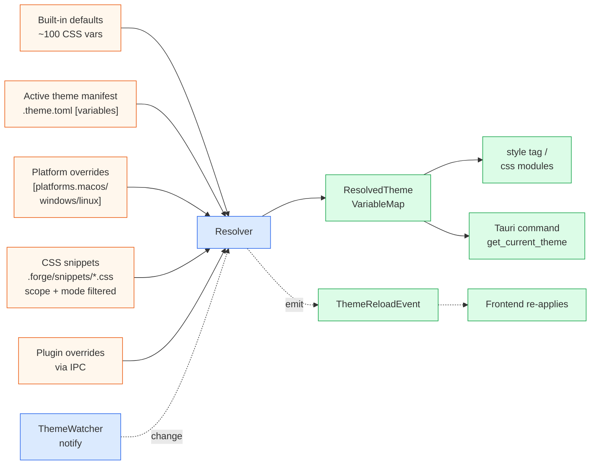
```mermaid
flowchart LR
    D[Built-in defaults<br/>~100 CSS vars] --> R[Resolver]
    T["Active theme manifest<br/>.theme.toml [variables]"] --> R
    P["Platform overrides<br/>[platforms.macos/<br/>windows/linux]"] --> R
    S[CSS snippets<br/>.forge/snippets/*.css<br/>scope + mode filtered] --> R
    O[Plugin overrides<br/>via IPC] --> R
    R --> Out[ResolvedTheme<br/>VariableMap]
    Out --> Style["style tag /<br/>css modules"]
    Out --> TS[Tauri command<br/>get_current_theme]

    W[ThemeWatcher<br/>notify] -.change.-> R
    R -.emit.-> RE[ThemeReloadEvent]
    RE -.-> Front[Frontend re-applies]

    classDef input fill:#fff7ed,stroke:#ea580c;
    classDef core fill:#dbeafe,stroke:#2563eb;
    classDef output fill:#dcfce7,stroke:#16a34a;
    class D,T,P,S,O input
    class R,W core
    class Out,Style,TS,RE,Front output
```

Cascade priority (low → high): **defaults → theme → platform → snippets → plugin overrides**.

---

### 6.7 Forge Persistence Layout

```mermaid
flowchart TB
    subgraph Forge[User's forge directory e.g. ~/notes/]
        MD[Markdown files<br/>*.md - source of truth]
        Canvas[Canvas files<br/>*.canvas - JSON]
        Bases[Bases directories<br/>*.bases/<br/>  .schema.json<br/>  records.jsonl<br/>  views.json]

        subgraph HD[.forge/ hidden metadata]
            DB[(index.db<br/>SQLite WAL<br/>r2d2 pool)]
            TV[(search/<br/>Tantivy index)]
            KV[(kv.sqlite3<br/>kernel KV)]
            Logs[logs/audit.log<br/>append-only]
            Plugins[plugins/<br/>community .wasm<br/>+ plugin.toml<br/>+ settings.json]
            Temp[temp/<br/>atomic write staging]
            Layouts[layouts/<br/>saved JSON]
            Snips[snippets/<br/>*.css]
            Cfg[config.toml]
        end
    end

    Watcher[notify watcher<br/>debounce 300ms] -. watches .-> MD
    Watcher -. watches .-> Canvas
    Watcher -. watches .-> Bases
    Watcher -. watches .-> Plugins

    MD -- parse + index --> DB
    MD -- FTS index --> TV
    Canvas -- index --> DB
    Bases -- index --> DB

    Recon[reconcile<br/>FS vs index] -. patches .-> DB

    classDef src fill:#fef9c3,stroke:#ca8a04;
    classDef idx fill:#dbeafe,stroke:#2563eb;
    classDef meta fill:#fce7f3,stroke:#be185d;
    class MD,Canvas,Bases src
    class DB,TV,KV idx
    class Logs,Plugins,Temp,Layouts,Snips,Cfg meta
```

---

### 6.8 Deployment Topology

How the pieces run on a user's machine.

```mermaid
flowchart LR
    subgraph User["User's Machine"]
        subgraph Term["Terminal"]
            CLIproc[nexus process]
            TUIproc[nexus-tui process]
        end
        subgraph Desktop["Desktop Session"]
            Tauri[nexus-app<br/>Tauri 2 shell]
            Webview[WebView<br/>webkit2gtk-4.1 /<br/>WebView2 / WkWebView]
            Tauri --- Webview
        end
        FS[(~/notes/ + .forge/)]
        Ring[(OS Keyring)]
        MCPClient[Claude Desktop /<br/>Cursor]
    end

    subgraph Cloud["Cloud / Remote"]
        Anth[api.anthropic.com]
        OAI[api.openai.com]
    end

    subgraph LocalAI["Local (optional)"]
        Oll[Ollama<br/>localhost:11434]
    end

    CLIproc -. stdio MCP .- MCPClient
    CLIproc --- FS
    CLIproc --- Ring
    TUIproc --- FS
    TUIproc --- Ring
    Tauri --- FS
    Tauri --- Ring

    CLIproc -. HTTPS .- Anth
    CLIproc -. HTTPS .- OAI
    CLIproc -. HTTP .- Oll
    Tauri -. HTTPS .- Anth
    Tauri -. HTTPS .- OAI
```

---

### 6.9 MCP Tool Dispatch

Every MCP tool call is re-expressed as an `ipc_call` — the same path a community WASM plugin would use.

```mermaid
sequenceDiagram
    autonumber
    participant Ext as External AI<br/>(Claude Desktop / Cursor)
    participant Proc as nexus mcp<br/>(stdio transport)
    participant Server as NexusMcpServer
    participant Router as tool_router
    participant Ctx as PluginContext
    participant Loader as SharedPluginLoader<br/>(IpcDispatcher)
    participant Core as Target core plugin<br/>(storage / ai)

    Ext->>Proc: {"method":"tools/call",<br/> "name":"nexus_search",<br/> "args":{"query":"rust"}}
    Proc->>Server: deserialize
    Server->>Router: route("nexus_search")
    Router->>Ctx: ipc_call("com.nexus.storage",<br/>"search",<br/>{query:"rust"}, 30s)
    Ctx->>Ctx: capability check:<br/>ipc.call ✓
    Ctx->>Loader: dispatch_async(target, cmd, args)
    Loader->>Core: invoke handler
    Core-->>Loader: serde_json::Value
    Loader-->>Ctx: IpcFuture resolves
    Ctx-->>Router: Value
    Router-->>Server: typed output<br/>(schemars)
    Server-->>Proc: tool result JSON
    Proc-->>Ext: MCP frame
```

---

## 7. Architectural Invariants & Guardrails

A short list of properties the codebase actively enforces. These are the invariants that make the diagrams above *true*, not just *aspirational*.

1. **Kernel depends only on `nexus-types`.** Any crate adding `nexus-kernel` imports something else from the workspace violates the microkernel boundary.
2. **`nexus-storage` is the sole `rusqlite` owner.** Plugins (core or WASM) and support libraries (`nexus-database`) never import storage backends directly. `nexus-ai`, community WASM, and `nexus-database` do not depend on `rusqlite` or `tantivy`. SQL-backed bases operations (schema, query, relation) live inside `nexus-storage` under the `bases::` module; everyone else routes through `ipc_call("com.nexus.storage", ...)`. Enforced by `crates/nexus-bootstrap/tests/dep_invariants.rs`.
3. **Invokers (CLI, TUI) do not reach into subsystems.** They go through `nexus-bootstrap` and then speak to the kernel. `nexus-cli` does not depend on `nexus-storage`.
4. **File-as-truth.** The SQLite index is strictly derived state. `reconcile()` can rebuild it from the filesystem. No user content lives only in the DB.
5. **Event type-ID namespacing.** A plugin can only publish `Custom` events whose `type_id` starts with its own plugin ID. The kernel sets `emitting_plugin` — plugins cannot forge it.
6. **Capability-first.** Every `PluginContext` method checks the caller's capability set before performing the op; denial is audited.
7. **Atomic file writes.** `atomic_write` writes to `.forge/temp/`, fsyncs, then renames into place.
8. **Hard-fail on missing keyring.** If the OS keyring is unavailable, the runtime refuses to boot rather than silently falling back to plaintext (ADR 09).
9. **Async everywhere at boundaries.** `PluginContext` is `async_trait`; IPC dispatch offers a sync `dispatch` and an async `dispatch_async` returning `IpcFuture`.
10. **TypeScript types are generated, never hand-written.** `ts-rs` turns `WorkspaceLayout`, `Tab`, `Panel`, etc. into `.ts` files — no manual JSON schema drift across the Tauri bridge.

---

## 8. Legend

**Colors used in supplementary diagrams:**

- 🟩 Green — leaf / no-internal-deps crates (`nexus-types`, `nexus-formats`, `nexus-git`, `nexus-theme`)
- 🟦 Blue — microkernel substrate (`nexus-kernel`, `nexus-kv`, `nexus-plugins`)
- 🟨 Yellow / orange — core plugin or source data
- 🟪 Purple — binary invokers (`nexus-cli`, `nexus-tui`, `nexus-app`, bootstrap)

**C4 shape conventions** (used in Levels 1–3):

- `Person` / `Person_Ext` — human actors
- `System` / `System_Ext` — our system vs. external
- `Container` — a runnable/deployable unit (binary, library, DB)
- `Component` — a module / major type within a container
- Arrows show **direction of a call / data flow** and are labelled with protocol

---

*Generated by static analysis of the Nexus workspace (`crates/*` + `app/`, Cargo.toml dependency graph, module layouts in `lib.rs` / `mod.rs`, and the project's ADRs and session summaries). File references in the source exploration report live alongside this document in `docs/`.*
