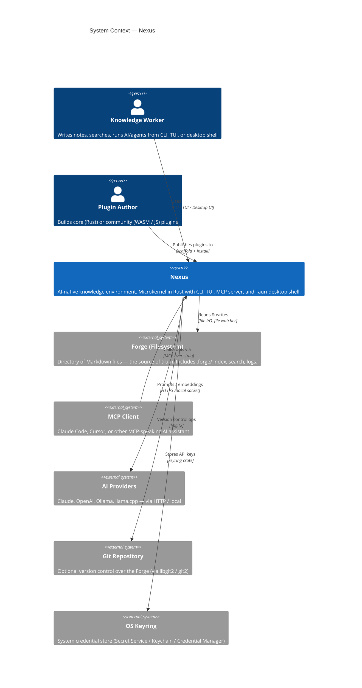
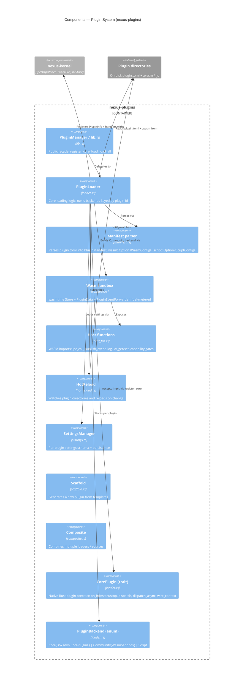
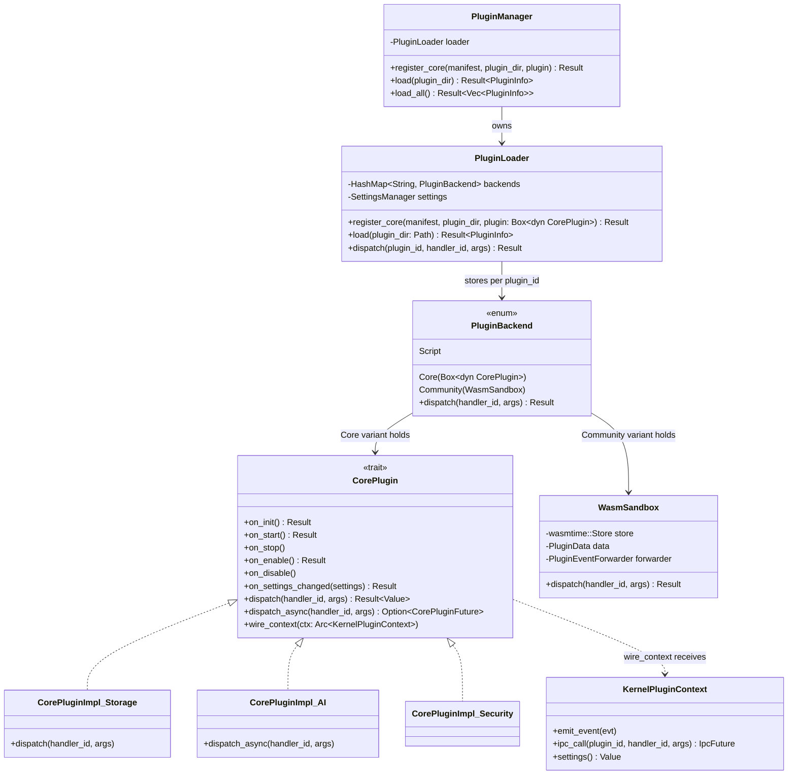
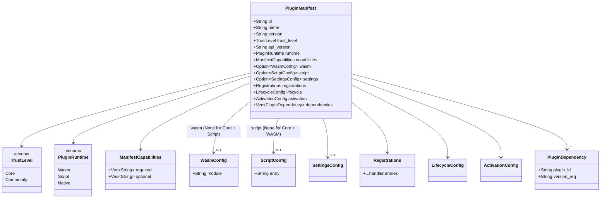

# Nexus — C4 Architecture Diagrams

A four-level C4 view of Nexus: an AI-native, plugin-extensible knowledge
environment built on a Rust microkernel, accessible via CLI, TUI, MCP server,
and a Tauri 2 desktop shell. Source of truth on disk (the "Forge") with a
rebuildable SQLite + Tantivy index.

The diagrams below are authored in Mermaid and render natively in
GitHub and VS Code.

---

## Level 1 — System Context

Shows Nexus as a single system and the people and external systems it
interacts with. The user works with a Forge (a directory of markdown files
that Nexus indexes) and optionally hands Nexus off to an MCP-capable AI
client (Claude Code, Cursor) or external AI provider APIs. Plugins are
also an external artifact — authored outside the system and installed into it.



---

## Level 2 — Containers

Zooms in on Nexus itself. The Rust workspace (`crates/`) produces several
binaries and a shared kernel: the CLI (`nexus`), the TUI (`nexus-tui`), the
MCP server (a CLI subcommand), and the Tauri desktop shell (`nexus-app`
crate + `shell/src-tauri` + `app/` React frontend). All of these sit on top
of the same core crates (kernel, storage, plugins, security, ai, etc.).

```mermaid
C4Container
    title Containers — Nexus

    Person(user, "User")
    System_Ext(forge, "Forge (Filesystem)")
    System_Ext(mcpClient, "MCP Client")
    System_Ext(aiProvider, "AI Providers")
    System_Ext(osKeyring, "OS Keyring")

    System_Boundary(nexus, "Nexus") {
        Container(cli, "nexus CLI", "Rust binary (nexus-cli, clap)", "Headless command-line interface — forge/content/graph/plugin/ai/mcp subcommands")
        Container(tui, "nexus-tui", "Rust binary (nexus-tui, ratatui)", "Terminal UI for browsing/searching the Forge")
        Container(mcp, "MCP Server", "Rust (nexus-mcp, rmcp)", "Exposes 13 tools over stdio to MCP clients")
        Container(desktopShell, "Desktop Shell", "Tauri 2 (nexus-app + shell/src-tauri)", "Hosts the React frontend and bridges IPC to Rust subsystems")
        Container(webUi, "Web UI", "React + Vite + TypeScript (app/)", "Frontend: editor, file tree, theme picker, plugin views")

        Container_Boundary(core, "Core (Rust workspace crates)") {
            Container(kernel, "nexus-kernel", "Rust lib", "Event bus, plugin lifecycle, capability enforcement, IPC dispatcher, KernelPluginContext")
            Container(plugins, "nexus-plugins", "Rust lib + wasmtime", "Plugin loader, manifests, WASM sandbox, hot-reload, settings")
            Container(security, "nexus-security", "Rust lib", "OS keyring vault, audit logging, path validation")
            Container(storage, "nexus-storage", "Rust lib", "File-as-truth, SQLite index, Tantivy FTS, file watcher, knowledge graph")
            Container(ai, "nexus-ai", "Rust lib + reqwest", "Provider traits (Claude/OpenAI/Ollama/llama.cpp), embeddings, RAG")
            Container(editor, "nexus-editor", "Rust lib", "Editor engine (PRD-08)")
            Container(terminal, "nexus-terminal", "Rust lib + portable-pty", "Terminal & process manager")
            Container(database, "nexus-database", "Rust lib", "Database engine (PRD-10)")
            Container(git_crate, "nexus-git", "Rust lib + git2", "Git integration")
            Container(theme, "nexus-theme", "Rust lib", "Theming engine, CSS vars, snippet cascade")
            Container(agent, "nexus-agent", "Rust lib", "Agent system (PRD-15)")
            Container(skills, "nexus-skills", "Rust lib", "Skills (PRD-13)")
            Container(workflow, "nexus-workflow", "Rust lib", "Workflow system (PRD-16)")
            Container(bootstrap, "nexus-bootstrap", "Rust lib", "Wires core plugins into the kernel at startup")
            Container(formats, "nexus-formats", "Rust lib", "File-format parsing/serialization")
            Container(types, "nexus-types", "Rust lib", "Shared type definitions")
            Container(pluginApi, "nexus-plugin-api", "Rust lib", "Public plugin SDK surface")
            Container(kv, "nexus-kv", "Rust lib", "Key/value store")
        }

        ContainerDb(indexDb, "Forge Index", "SQLite (WAL) + Tantivy", "Rebuildable index over .forge/index.db and .forge/search/")
        Container(extApi, "nexus-extension-api", "TS package (packages/)", "TypeScript SDK for JS/script plugins in the WebView")
        Container(communityPlugins, "Community Plugins", "WASM modules + JS", "User-installed plugins loaded at runtime")
    }

    Rel(user, cli, "Invokes")
    Rel(user, tui, "Interacts")
    Rel(user, desktopShell, "Uses GUI")
    Rel(mcpClient, mcp, "Tool calls", "stdio / MCP")

    Rel(desktopShell, webUi, "Hosts in WebView")
    Rel(webUi, desktopShell, "IPC invokes", "Tauri commands")
    Rel(webUi, extApi, "Imports")

    Rel(cli, kernel, "Uses")
    Rel(tui, kernel, "Uses")
    Rel(mcp, kernel, "Uses")
    Rel(desktopShell, kernel, "Uses")
    Rel(desktopShell, bootstrap, "Starts subsystems via")

    Rel(kernel, plugins, "Manages")
    Rel(kernel, storage, "Dispatches to")
    Rel(kernel, ai, "Dispatches to")
    Rel(plugins, communityPlugins, "Loads + sandboxes")
    Rel(storage, indexDb, "Reads / writes")
    Rel(storage, forge, "Watches + persists to")
    Rel(security, osKeyring, "Stores secrets in")
    Rel(ai, aiProvider, "HTTPS")
    Rel(git_crate, forge, "libgit2 operations on")

    UpdateLayoutConfig($c4ShapeInRow="3", $c4BoundaryInRow="1")
```



---

## Level 3 — Components

Two component-level views: first inside the Rust core (kernel + its
collaborators), then inside the plugin system. Core plugins are registered
natively via `PluginLoader::register_core` and implement the `CorePlugin`
trait; community plugins are loaded from a plugin directory via
`PluginLoader::load`, which rejects any manifest whose `trust_level = "core"`.
A third backend variant, `Script`, runs handlers in the Tauri WebView.

### 3a. Rust core (around `nexus-kernel`)

```mermaid
C4Component
    title Components — Rust Core (nexus-kernel and collaborators)

    Container_Boundary(kernelBoundary, "nexus-kernel") {
        Component(kernelFacade, "Kernel", "kernel.rs", "Top-level facade; owns event bus + KV store + lifecycle flag")
        Component(eventBus, "EventBus", "event_bus.rs / event.rs", "Pub/sub fan-out with EventFilter + EventSubscription")
        Component(ipcDispatcher, "IpcDispatcher", "ipc.rs", "Routes handler_id + JSON args to the owning backend; returns IpcFuture")
        Component(capability, "Capability / CapabilitySet", "capability.rs", "Declared + granted capability sets enforced at dispatch time")
        Component(ctx, "KernelPluginContext", "context.rs / context_impl.rs", "Per-plugin handle: emit events, call other plugins, read settings")
        Component(kvStore, "KvStore", "kv_store.rs", "Small persistent KV for kernel/plugin metadata")
        Component(config, "Config", "config.rs", "Runtime config")
        Component(log, "Log", "log.rs", "Structured tracing facade")
    }

    Container_Ext(plugins, "nexus-plugins", "Plugin loader + sandbox")
    Container_Ext(security, "nexus-security", "Keyring + audit")
    Container_Ext(storage, "nexus-storage", "Forge persistence + FTS + graph")
    Container_Ext(ai, "nexus-ai", "AI providers")
    Container_Ext(bootstrap, "nexus-bootstrap", "Wires core plugins at startup")

    Rel(kernelFacade, eventBus, "Owns")
    Rel(kernelFacade, pluginRegistry, "Owns")
    Rel(kernelFacade, ipcDispatcher, "Owns")
    Rel(ipcDispatcher, capability, "Checks")
    Rel(ipcDispatcher, pluginRegistry, "Looks up backend via")
    Rel(ctx, eventBus, "Publishes / subscribes via")
    Rel(ctx, ipcDispatcher, "Nested ipc_call via")

    Rel(bootstrap, kernelFacade, "Registers core plugins with")
    Rel(plugins, pluginRegistry, "Populates")
    Rel(plugins, ipcDispatcher, "Installs handlers into")
    Rel(plugins, ctx, "Hands out per-plugin")
    Rel(storage, ctx, "Registered as a core plugin, uses")
    Rel(security, ctx, "Registered as a core plugin, uses")
    Rel(ai, ctx, "Registered as a core plugin, uses")

    UpdateLayoutConfig($c4ShapeInRow="3", $c4BoundaryInRow="1")
```

### 3b. Plugin system (`nexus-plugins`)



---

## Level 4 — Code

Class-level views of the two most load-bearing abstractions:
the `CorePlugin` trait with its `PluginBackend` enum, and the
`PluginManifest` type family.

### 4a. `CorePlugin`, `PluginBackend`, and the loader



### 4b. `PluginManifest` type family



---

## Notes and gaps

- Every TODO comment above marks a spot where the diagram was sketched from
  docstrings and high-level references without reading the full type
  definition. They are safe defaults; refine when touching that code.
- `nexus-editor`, `nexus-terminal`, `nexus-database`, `nexus-agent`,
  `nexus-skills`, and `nexus-workflow` are shown at Container level only —
  each has its own PRD in `docs/PRDs/` and would deserve its own Level 3
  diagram if/when its implementation stabilises.
- The React frontend (`shell/src/`) has substructure (`shell/`,
  `workspace/`, `host/`, `registry/`, `stores/`, `plugins/{core,nexus,community}/`)
  that a future Level 3 pass should cover now that the plugin-first
  Tauri shell is the single desktop target (see ADR 0011).
