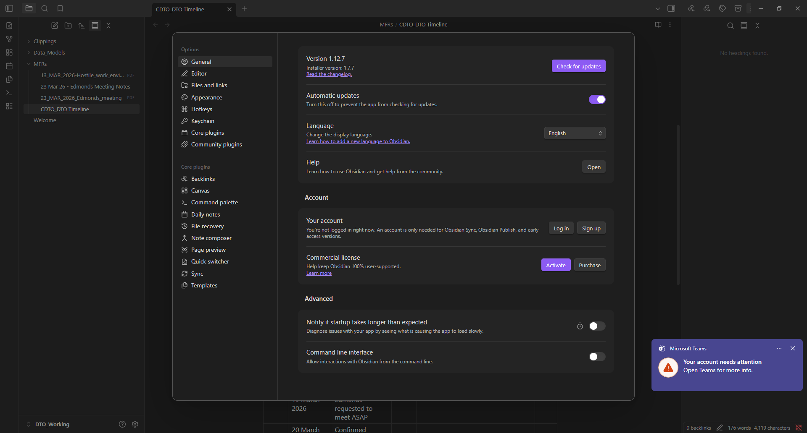

# Obsidian Settings Modal — UX Reference

Reference capture of Obsidian's Settings modal (v1.12.7), used as the
structural template for the Nexus Settings modal.

## Overall shape

- Centered modal, roughly 80–90% of viewport; not fullscreen, not dialog-tiny.
- Two-pane layout inside the modal:
  - **Left rail** — fixed width (~280px), scrollable, grouped tab list.
  - **Right pane** — scrollable content for the active tab.
- Top-right close control (X). Esc closes. Clicking outside closes.

## Left rail — grouped tabs

The rail is a vertical list of tabs organised under **uppercase section
headers**. Each entry has a Lucide-style icon and a short label.

Obsidian's groups (top to bottom):

1. **Options** — core app tabs:
   - General, Editor, Files and links, Appearance, Hotkeys, Keychain,
     Core plugins, Community plugins.
2. **Core plugins** — one tab per core plugin that has settings:
   - Backlinks, Canvas, Command palette, Daily notes, File recovery,
     Note composer, Page preview, Quick switcher, Sync, Templates.
3. **Community plugins** — one tab per installed community plugin with
   settings (scrolls below the fold in the screenshot).

Key implications:

- **Plugins contribute tabs, not a single "Plugins" page.** Each plugin
  with declared settings gets its own rail entry.
- **Hotkeys is a first-class top-level tab**, not nested under a
  "Keyboard" or "Advanced" sub-page.
- **Tab order within a group is flat** — no sub-tabs, no accordions.

## Right pane — setting rows

The right pane is a vertical scroll of **setting rows**, optionally
grouped under h2 section headers.

A setting row has:

- Left side: bold **title** on line 1, smaller grey **description** on
  line 2 (may contain links, e.g. "Read the changelog.").
- Right side: one control — a toggle, button, button-group, select,
  input, or pair of buttons (e.g. "Log in" / "Sign up").

The screenshot shows three groups on the General tab:

1. (Unnamed) — Version, Automatic updates, Language, Help.
2. **Account** — Your account (Log in / Sign up), Commercial license
   (Activate / Purchase).
3. **Advanced** — Notify if startup slow, Command line interface.

Visual rhythm: generous vertical padding between rows, a thin divider
between groups. The top of the right pane has no explicit "General"
header — the left-rail highlight is the only tab indicator.

## Control patterns observed

- **Toggle** — right-aligned pill switch for booleans
  (Automatic updates, Advanced flags).
- **Button** — primary action ("Check for updates", "Open", "Activate").
- **Button pair** — two buttons side-by-side for mutually-exclusive
  actions ("Log in" / "Sign up").
- **Select** — native-looking dropdown with caret (Language → English).
- **Link in description** — inline anchor within the grey subtitle.
- **Icon hint next to toggle** — e.g. the stopwatch glyph next to
  "Notify if startup takes longer than expected" hints at category.

## Mapping to Nexus

The mapping leans on primitives we already have:

| Obsidian surface         | Nexus equivalent                                         |
|--------------------------|----------------------------------------------------------|
| Left rail "Options" tabs | Hard-coded app tabs (General, Appearance, Hotkeys, …)    |
| "Core plugins" group     | Plugins where `manifest.trust_level == Core`             |
| "Community plugins" group| Plugins where `manifest.trust_level == Community`        |
| Per-plugin settings tab  | Plugins that declare `[settings] schema = "…"`           |
| Hotkeys tab content      | `contributions.listPaletteCommands()` + future bindings  |
| Setting row (toggle/input/select) | JSON-schema driven form from `SettingsManager`    |

New manifest additions this implies (later, not in the first slice):

- `ui_settings_tab` registration entry — id, title, icon, handler_id
  returning the form spec. Matches the shape of `ui_command`.
- Optional `category` on `ui_command` already exists and can be reused
  for Hotkeys tab section grouping.

## Proposed first slice for Nexus Settings

Goal: prove the modal shell and make one tab per surface useful.

1. `<SettingsModal>` with the two-pane shell, portal + focus trap,
   driven by a `useSettingsStore` that mirrors `usePaletteStore`.
2. Three static tabs:
   - **General** — move the existing theme toggle (currently on the
     home workspace) into this tab.
   - **Hotkeys** — read-only list of every registered palette command
     from `contributions.listPaletteCommands()`. No binding UI yet.
   - **Community plugins** — read-only list of loaded plugins from a
     new `list_plugins` Tauri command that reuses
     `PluginManager::list()`.
3. Wire the existing `workspace.settings` command (currently a stub
   `alert()` in `app/src/contributions/builtins.ts`) to open the modal.

Explicitly out of scope for the first slice:

- Plugin-contributed settings tabs.
- Editable hotkey bindings (keybinding field in manifest + capture UI).
- Per-plugin settings forms.
- Core-plugins group (no core plugins exist yet).

## Open design questions

- **Modal primitive**: the command palette hand-rolls its own
  `role="dialog"` element. Do we extract a shared `<Modal>` before
  building Settings, or let two concrete modals coexist and extract
  later? Recommendation: coexist; palette and settings have very
  different sizing and content models, so a premature primitive would
  be a wrapper over nothing useful.
- **Tab state in URL?** Obsidian does not deep-link tabs. Likely not
  worth the complexity for a desktop shell — internal state in the
  store is enough.
- **Search**: Obsidian has no settings search (noted by its absence).
  Skip for the first slice; revisit once there are enough tabs to
  warrant it.
