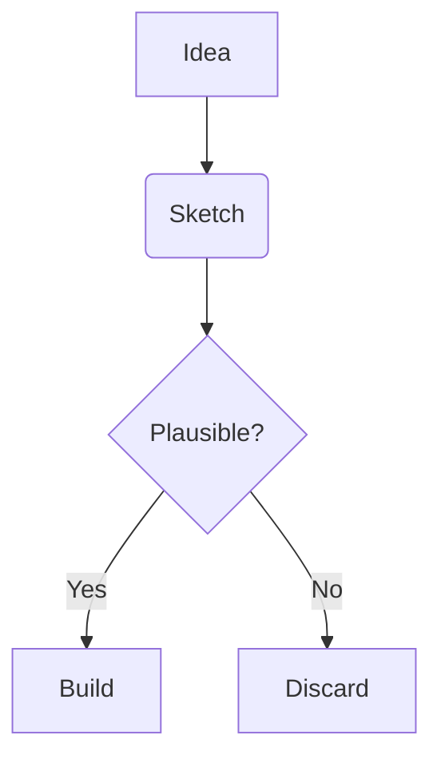

# Mermaid Diagrams (BL-008)

Renders fenced code blocks tagged with `mermaid` as SVG diagrams in the
editor's live and preview modes.

## Status

Default-off. Enable in **Settings → Plugins → Community → Mermaid
Diagrams**. Mermaid (~150 KB gzipped) is a lazy chunk and only fetched
on first render after the plugin activates.

## Implementation note

The directory is laid out like a community plugin
(`plugin.json` + `index.ts` source) but registration flows through
the shell catalog as a default-off entry rather than the runtime
community-plugin loader. The community loader's Blob-URL import path
can't resolve bare-specifier imports like `import "mermaid"` without a
plugin-side bundler, and inlining mermaid into a hand-rolled JS
bundle is impractical. Treating the directory as a Vite-bundled
plugin keeps the `~150 KB opt-in` semantics intact and the user-facing
opt-in flow identical, at the cost of a manifest entry that is
informational only (`enabled: false` in `plugin.json`). Once a
community-plugin bundler lands, the catalog wiring will be deleted and
the plugin will load through the standard discovery path.

## Renderer contract

The plugin uses the BL-008 fenced-code-renderer registry exposed on
`api.editor.registerFencedCodeRenderer(language, renderer)`. See
`@nexus/extension-api` for the full type signature. Other diagram
libraries (PlantUML, vis.js, DOT) can register the same way without
touching shell internals.
